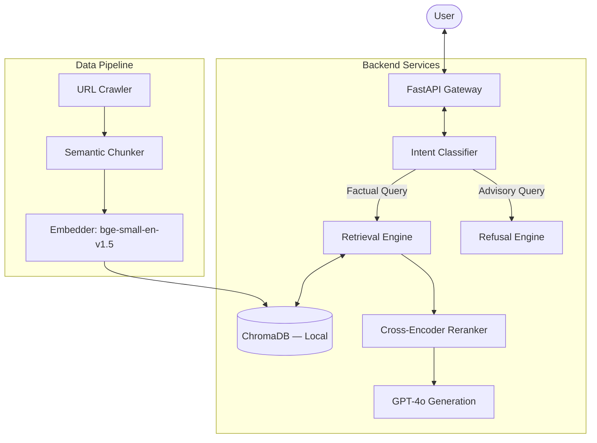

# Technical Specification: Mutual Fund FAQ Assistant (RAG Architecture)

> [!NOTE]
> **Technical Summary (Plain English)**
> This project builds a "Facts-Only" assistant that answers common questions about Mutual Funds (like fees and risk) using data from official websites. It is designed to never give investment advice and always show you exactly where the information came from.


---

## 1. High-Level System Architecture

The system utilizes a modular RAG pipeline with a specific focus on **advisory refusal** and **source grounding**.



---

## 2. Implementation Specifications

### 2.1 Project Directory Structure
A modular structure to separate concerns between raw data processing and the chat engine.

```text
mutual-fund-faq/
├── apps/
│   ├── web/                # Next.js Frontend
│   │   ├── components/     # UI Components (Chat, Disclaimer, Citations)
│   │   └── hooks/          # API Communication
│   └── api/                # FastAPI Backend
│       ├── core/           # RAG Engine (Retriever, Generator)
│       ├── routers/        # API Endpoints
│       └── utils/          # PII Scrubbers
├── data/
│   ├── raw/                # Extracted facts (targeted_schemes.json)
│   └── vector_db/          # ChromaDB persistent store (SQLite-backed)
├── scripts/
│   ├── ingest.py           # Playwright scraper → data/raw/targeted_schemes.json
│   ├── index.py            # Chunking + BGE Embedding → ChromaDB upsert
│   └── eval_ragas.py       # Performance Metrics (RAGAS)
└── README.md
```

### 2.2 API Specification
**Endpoint**: `POST /api/chat/query`

**Request Body**:
```json
{
  "thread_id": "uuid-1234",
  "query": "What is the exit load for Groww Nifty 50?",
  "scheme_name": "Groww Nifty 50 Index Fund"
}
```

**Response Body**:
```json
{
  "answer": "The exit load for Groww Nifty 50 Index Fund is nil if redeemed or switched out on or before 30 days from the date of allotment. For redemptions after 30 days, no exit load is applicable.",
  "citation": "https://www.growwmf.in/schemes/nifty-50-index-fund",
  "last_updated": "2024-04-10",
  "is_advisory": false
}
```

---

## 3. RAG Engine Logic

### 3.1 Prompt Library

#### System Prompt (Facts-Only Guardrail)
```text
Role: You are an objective Mutual Fund FAQ Assistant.
Task: Answer the user's question using ONLY the provided context.

Constraints:
1. Max 3 sentences.
2. If context is missing, say "I cannot find official info for this."
3. NO investment advice, opinions, or "best fund" comparisons.
4. If asked generic advice, trigger REFUSAL_MODE.

Citation Format: 
[Answer]
Source: [URL]
Last updated from sources: [Date]
```

#### Refusal Prompt (Subjective/Advisory Queries)
```text
Trigger: User asks "Should I invest?" or "Is this better than X?"
Response: "I am a facts-only assistant and cannot provide investment advice or comparisons. Please consult a SEBI-registered advisor for personal investment decisions. You can learn more about MF basics here: [SEBI URL]"
```

### 3.2 The Retrieval Engine (Query Flow)

The Retrieval engine operates within the `apps/api/core/retriever.py` module and handles the core data-fetching mechanism in real time. It consists of the following 4-step factual journey:

1. **Refusal Guardrail (Pre-Retrieval Analysis)**
   - Before hitting the Vector DB, the system runs an `is_advisory_query` heuristic.
   - If a user asks "Which fund is best?" or "Should I invest?", the process halts and the user receives a strict compliance refusal.

2. **Vectorization & Connection**
   - The user's query is converted into a 384-dimensional mathematical array using the local `BAAI/bge-small-en-v1.5` model.
   - The backend authenticates and connects via the `chromadb.CloudClient` to the remote Chroma Cloud Database mapping to the user's specific `Tenant` and `Database`.

3. **Semantic Search & Filtering**
   - A semantic proximity search is performed to find the closest `top_k=3` factual chunks.
   - Using ChromaDB's local metadata filters, the search is scoped exclusively to the official AMC collections (e.g., `nippon_india`, `general`) to guarantee zero cross-contamination of facts.

4. **Context Assembly & Hand-off**
   - The matched raw chunks, their official `citation` (Groww URL), and their `last_updated` times are packaged and passed upward to the GenAI module for synthesis.
---

## 4. UI Component Blueprint (Next.js/Tailwind)

| Component | Responsibility | Requirements |
| :--- | :--- | :--- |
| `ChatInterface` | Main interaction hub | Multi-thread support via `thread_id`. |
| `DisclaimerBanner` | Legal Compliance | Persistent "Facts-only. No investment advice." text. |
| `SourceTag` | Transparency | Renders a clickable citation link below every answer. |
| `RefusalLink` | Educational | Renders educational links when advisory queries are flagged. |
| `ExampleChip` | User Onboarding | 3 pre-defined factual questions (e.g., "What is Expense Ratio?"). |

---

## 5. Security & Compliance

- **PII Guardrail**: `langchain-scrub` middleware to block PAN/Aadhaar/Phone numbers before they hit the LLM.
- **Audit Log**: Every query-response pair is stored in a `logs` table for compliance review, ensuring no advisory bias creep.

---

---

## 7. Project Scope & Content Definition

As per the requirements, the system is bounded by a curated "Facts-Only" corpus.

- **Target Schemes (In Scope URLs)**:
    - [Nippon India Large Cap Fund](https://groww.in/mutual-funds/nippon-india-large-cap-fund-direct-growth)
    - [Nippon India Taiwan Equity Fund](https://groww.in/mutual-funds/nippon-india-taiwan-equity-fund-direct-growth)
    - [HDFC Mid-Cap Opportunities Fund](https://groww.in/mutual-funds/hdfc-mid-cap-fund-direct-growth)
    - [Quant Small Cap Fund](https://groww.in/mutual-funds/quant-small-cap-fund-direct-plan-growth)
    - [Nippon India Growth Fund](https://groww.in/mutual-funds/nippon-india-growth-mid-cap-fund-direct-growth)

- **Scheme Diversity**:
    - **Large-Cap**: Focus on blue-chip holdings and benchmark stability.
    - **Mid-Cap / Small-Cap**: Focus on higher growth segments.
    - **Sectoral/Thematic**: Exposure to specific regions (e.g., Taiwan).

- **Data Strategy**:
    - **Focused Extraction**: The system relies purely on scraping factual data directly from the HTML of the 5 targeted scheme URLs above.
    - **No PDF Processing**: Currently, we are not extracting any data from statutory documents (no SID, KIM, or Factsheet PDFs will be processed).

---

## 8. Detailed Ingestion Pipeline Specification

The data pipeline is designed for high fidelity, especially for tabular data.

### Step 1: Scraping Service (Targeted Extraction)
The system employs a dedicated **Scraping Service** (built with `Playwright` or `BeautifulSoup4`) to interact directly with the specified Groww scheme URLs.

- **Direct Navigation**: The service accesses and gets the data from the 5 hardcoded scheme URLs.
- **Fact Extraction**: For each scheme, the service extracts the 6 required factual data points directly from the `groww.in` HTML (e.g., Current NAV, Minimum SIP, Expense Ratio, etc.).
- **No PDF Downloads**: All additional data and document link parsing have been removed. We do not download or process PDFs.
- **Anti-Blocking**: Implements randomized user-agents and throttling to ensure reliable access to public financial data.

### Step 2: Content Structuring & Meta-Hashing
- **Strategy**: The 6 factual data points extracted from the HTML are structured as logical units.
- **Inheritance**: Each fact-chunk is tagged with the `scheme_name` (e.g., "Nippon India Taiwan Equity Fund").
- **Timestamping**: Metadata includes the specific scraping timestamp (9:15 AM IST) to ensure transparency regarding data freshness.

### Step 3: Embedding & Vector Upsert
Vectors are generated using `BAAI/bge-small-en-v1.5` (via `sentence-transformers`) and upserted to a remote **[Chroma Cloud](https://www.trychroma.com/)** instance. The database is persistent and remotely managed, ensuring data is accessible to the distributed API without requiring local storage on the server.

### Step 4: Scheduler (GitHub Actions Freshness)
To ensure the "Facts-Only" assistant remains current with the latest NAV updates:
- **Scheduler Service**: **GitHub Actions**.
- **Workflow Configuration**: Uses a `.github/workflows/ingest.yml` file with a cron-based trigger.
- **Execution Time**: **9:15 AM daily**, at which point it will run and get the latest data.

---

## 9. Success Metrics & Verification

| Metric | Target | Tool |
| :--- | :--- | :--- |
| **Retrieval Precision** | >0.85 | RAGAS (Context Precision) |
| **Faithfulness** | 100% | RAGAS (Faithfulness) |
| **Response Latency** | <2.5s | OpenTelemetry / Custom Logging |
| **Advice Detection** | 0.0% | Adversarial LLM testing |

---

## 10. Phase-wise Implementation Plan

> [!NOTE]
> **Plain English**: This section maps every design decision and code file to the phase in which it was built. Use this as your project roadmap — each phase is a self-contained milestone.

---

### Phase 1 — Conceptual Design & RAG Blueprint
**Goal**: Establish the "Facts-Only" system constraints and draw the high-level architecture.

| Deliverable | File | Status |
| :--- | :--- | :--- |
| Initial RAG flow diagram | [architecture.md](./architecture.md) | ✅ Done |
| Facts-Only guardrail definition | [architecture.md § 3.1](./architecture.md) | ✅ Done |

---

### Phase 2 — Technical Specification
**Goal**: Define the project directory structure, API schema, and prompt library.

| Deliverable | File | Status |
| :--- | :--- | :--- |
| Project directory blueprint | [architecture.md § 2.1](./architecture.md) | ✅ Done |
| API request/response schema | [architecture.md § 2.2](./architecture.md) | ✅ Done |
| System & Refusal prompts | [architecture.md § 3.1](./architecture.md) | ✅ Done |
| UI Component blueprint | [architecture.md § 4](./architecture.md) | ✅ Done |

---

### Phase 3 — Project Scope & Target URLs
**Goal**: Lock down the 5 targeted scheme URLs and establish a direct-extraction data strategy.

| Deliverable | File | Status |
| :--- | :--- | :--- |
| 5 Target Scheme URLs (Nippon, HDFC, Quant) | [architecture.md § 7](./architecture.md) | ✅ Done |
| Direct factual extraction strategy | [architecture.md § 7](./architecture.md) | ✅ Done |

---

### Phase 4 — Daily Scheduler Requirement
**Goal**: Define the automated 9:15 AM IST data refresh requirement.

| Deliverable | File | Status |
| :--- | :--- | :--- |
| Scheduler specification | [architecture.md § 8 Step 5](./architecture.md) | ✅ Done |
| GitHub Actions as scheduler platform | [.github/workflows/ingest.yml](../.github/workflows/ingest.yml) | ✅ Done |

---

### Phase 5 — Scraping Service Specification
**Goal**: Define the dedicated Playwright-based crawler for Groww AMC pages.

| Deliverable | File | Status |
| :--- | :--- | :--- |
| Scraping service spec | [architecture.md § 8 Step 1](./architecture.md) | ✅ Done |
| Scraping implementation | [scripts/ingest.py](../scripts/ingest.py) | ✅ Done |

---

### Phase 6 — GitHub Actions Scheduler Integration
**Goal**: Implement the automation backbone using GitHub Actions CI/CD.

| Deliverable | File | Status |
| :--- | :--- | :--- |
| `ingest` job (scraping trigger) | [.github/workflows/ingest.yml](../.github/workflows/ingest.yml) | ✅ Done |
| Artifact upload configuration | [.github/workflows/ingest.yml](../.github/workflows/ingest.yml) | ✅ Done |

---

### Phase 7 — Product Preview & Documentation
**Goal**: Create a user-friendly text-based mockup of the chat interface.

| Deliverable | File | Status |
| :--- | :--- | :--- |
| UI interaction mockup | [Docs/preview.md](./preview.md) | ✅ Done |
| Welcome message & example chips | [Docs/preview.md](./preview.md) | ✅ Done |
| Refusal flow demonstration | [Docs/preview.md](./preview.md) | ✅ Done |

---

### Phase 8 — Targeted Scraping & Automation
**Goal**: Implement the high-precision extraction pipeline for specific scheme URLs.

| Deliverable | File | Status |
| :--- | :--- | :--- |
| Targeted Scraper (5 Focus Funds) | [scripts/ingest.py](../scripts/ingest.py) | ✅ Done |
| Consolidated Fact JSON | `data/raw/targeted_schemes.json` | ✅ Ready |
| Indexing & Embedding Engine | [scripts/index.py](../scripts/index.py) | ✅ Done |
| Automated Scheduler Config | [.github/workflows/ingest.yml](../.github/workflows/ingest.yml) | ✅ Done |

---

### Phase 9 — Verification & Logic Validation
**Goal**: Verify CSS selectors on live Groww pages and audit the scheduler YAML.

| Deliverable | File | Status |
| :--- | :--- | :--- |
| Selector audit (NAV, SID, links) | Simulated via browser subagent | ✅ Verified |
| Cron time validation (9:15 AM IST) | [.github/workflows/ingest.yml](../.github/workflows/ingest.yml) | ✅ Verified |

---

### Phase 10 — Raw Data Inventory
**Goal**: Create a human-readable inventory for all ingested scheme data.

| Deliverable | File | Status |
| :--- | :--- | :--- |
| Scheme discovery manifest | [Docs/raw_data.md](./raw_data.md) | ✅ Done |
| PII & compliance checklist | [Docs/raw_data.md](./raw_data.md) | ✅ Done |

---

### Phase 11 — Deployment Preparation
**Goal**: Configure the repository for a safe, clean GitHub push.

| Deliverable | File | Status |
| :--- | :--- | :--- |
| `.gitignore` (cache & data exclusions) | [.gitignore](../.gitignore) | ✅ Done |
| `data/raw/.gitkeep` | `data/raw/.gitkeep` | ✅ Done |
| `data/processed/.gitkeep` | `data/processed/.gitkeep` | ✅ Done |

---

### Phase 12 — Structured Data Extraction (6 Key Fields)
**Goal**: Extract exactly the 6 factual fields required for the FAQ assistant.

| Deliverable | File | Status |
| :--- | :--- | :--- |
| Updated scraper (NAV, SIP, AUM, Ratio, Load, Rating) | [scripts/ingest.py](../scripts/ingest.py) | ✅ Done |
| JSON storage schema definition | [Docs/raw_data.md](./raw_data.md) | ✅ Done |

---

### Phase 13 — Chunking & Embedding Architecture
**Goal**: Build the data processing pipeline that converts raw facts into searchable vectors.

| Deliverable | File | Status |
| :--- | :--- | :--- |
| Chunking & Embedding architecture doc | [Docs/chunking_embedding_architecture.md](./chunking_embedding_architecture.md) | ✅ Done |
| `embed` job in GitHub Actions | [.github/workflows/ingest.yml](../.github/workflows/ingest.yml) | ✅ Done |
| Full indexing + embedding script ([ChromaDB](https://www.trychroma.com/) + BGE-small) | [scripts/index.py](../scripts/index.py) | ✅ Done |
| ChromaDB collection-per-AMC strategy | [Docs/chunking_embedding_architecture.md § 7](./chunking_embedding_architecture.md) | ✅ Done |

---

### Phase 14 — Targeted Scheme Data Extraction
**Goal**: Create a consolidated structured JSON file for the 5 specified target schemes.

| Deliverable | File | Status |
| :--- | :--- | :--- |
| `targeted_schemes.json` (5 schemes) | [data/raw/targeted_schemes.json](../data/raw/targeted_schemes.json) | ✅ Done |

---

### Phase 15 — FastAPI Backend Implementation
**Goal**: Build the core RAG application gateway with Chroma Cloud retrieval and Gemini-powered factual synthesis.

| Deliverable | File | Status |
| :--- | :--- | :--- |
| API directory structure (`apps/api/`) | [apps/api/](./apps/api/) | ✅ Done |
| Chroma Cloud Retriever module | [apps/api/core/retriever.py](./apps/api/core/retriever.py) | ✅ Done |
| Google Gemini Generator module | [apps/api/core/generator.py](./apps/api/core/generator.py) | ✅ Done |
| FastAPI Main Gateway (`/api/chat/query`) | [apps/api/main.py](./apps/api/main.py) | ✅ Done |

---

### Upcoming Phases (Planned)

| Phase | Goal | Key File |
| :--- | :--- | :--- |
| **Phase 16** | Build Next.js frontend (Chat UI, Disclaimer, Chips) | `apps/web/` |
| **Phase 17** | RAGAS evaluation & compliance testing | `scripts/eval_ragas.py` |
| **Phase 18** | Full deployment & README | `README.md` |
