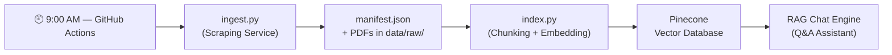
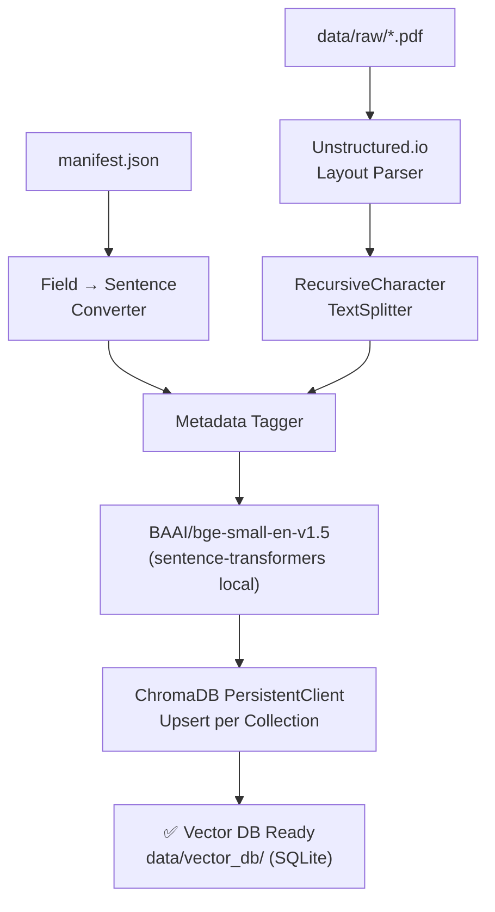

# Architecture: Chunking & Embedding Pipeline

> [!NOTE]
> **Plain English Summary**
> After the Scraping Service collects raw mutual fund data, this pipeline "reads" and "understands" it so the AI can search it later. Think of it as the AI **highlighting and indexing** a textbook before an exam — breaking it into small topics, then filing each topic with a unique fingerprint for instant retrieval.

---

## 1. Where This Fits in the System

This pipeline is a **separate stage** from the Scraping Service (`ingest.py`). It is triggered after the daily ingestion run completes and data is available in `data/processed/manifest.json`.



---

## 2. GitHub Actions Scheduler for This Pipeline

The Chunking & Embedding pipeline runs as a **second job** in the same daily GitHub Actions workflow, triggered automatically after `ingest.py` succeeds.

```yaml
# .github/workflows/ingest.yml (actual embed job)
jobs:
  ingest:          # Job 1: Playwright Scraping
    runs-on: ubuntu-latest
    steps:
      - uses: actions/checkout@v4
      - run: pip install playwright requests
      - run: python scripts/ingest.py
      - uses: actions/upload-artifact@v4
        with:
          name: mutual-fund-data
          path: |
            data/raw/
            data/processed/manifest.json

  embed:           # Job 2: Chunking & Embedding
    needs: ingest  # Only runs if ingestion succeeds
    runs-on: ubuntu-latest
    steps:
      - uses: actions/checkout@v4
      - uses: actions/download-artifact@v4
        with:
          name: mutual-fund-data
      - run: pip install openai pinecone-client langchain unstructured pypdf requests
      - name: Run Chunking & Embedding
        env:
          OPENAI_API_KEY:   ${{ secrets.OPENAI_API_KEY }}
          PINECONE_API_KEY: ${{ secrets.PINECONE_API_KEY }}
          PINECONE_INDEX:   ${{ secrets.PINECONE_INDEX }}
          PINECONE_ENV:     ${{ secrets.PINECONE_ENV }}
        run: python scripts/index.py
```

---

## 3. Two Sources of Input Data

The pipeline processes data from **two types of sources** produced by the scraper:

| Source | Format | Content |
| :--- | :--- | :--- |
| `data/raw/<amc>.json` | Structured JSON (Stage 1) | Per-AMC scheme list: NAV, SIP, Exit Load, Expense Ratio, AUM, Rating |
| `data/processed/manifest.json` | Structured JSON (Stage 2) | All AMCs merged into flat array — this is what `index.py` reads |
| `data/raw/*.pdf` | Unstructured PDF | SID, KIM, Factsheet text and tables |

---

## 4. Stage 1 — Chunking

Chunking splits large documents into smaller, semantically coherent pieces the AI can search efficiently.

### 4.1 Chunking Manifest JSON (Structured Data)

Since `manifest.json` is already structured, each field becomes its own **self-contained factual chunk**:

```
Input Record:
  scheme_name: "Axis Large Cap Fund – Direct Growth"
  exit_load:   "1% if redeemed within 12 months"

Output Chunk:
  text:     "The exit load for Axis Large Cap Fund – Direct Growth is
              1% if redeemed within 12 months."
  metadata: { field: "exit_load", scheme: "Axis Large Cap Fund", source_url: "...", last_updated: "2026-04-14" }
```

**Why this approach?**
Each field is converted into a natural language sentence. This means when a user asks "What is the exit load for Axis Large Cap Fund?", the retriever finds the **exact sentence** without filtering through paragraphs.

### 4.2 Chunking PDFs (Unstructured Data)

For SID, KIM, and Factsheets:
- **Tool**: `Unstructured.io` library
- **Strategy**: Layout-aware parsing to preserve **table structures** (SIP ranges, expense slabs)
- **Chunk Size**: ~800 tokens per chunk with 100-token overlap

```python
# Chunking Strategy for PDFs
from langchain.text_splitter import RecursiveCharacterTextSplitter

splitter = RecursiveCharacterTextSplitter(
    chunk_size=800,
    chunk_overlap=100,
    separators=["\n\n", "\n", ".", " "]
)
```

**Section-Aware Splitting**: Chunks are always split at section headers (e.g., "Scheme Features", "Load Structure") to avoid mixing content from different topics in a single chunk.

---

## 5. Stage 2 — Metadata Tagging

Every chunk (whether from JSON or PDF) is enriched with a standard metadata envelope before embedding:

```json
{
  "chunk_text":    "The minimum SIP for Axis Large Cap Fund is ₹100 per month.",
  "metadata": {
    "scheme_name":  "Axis Large Cap Fund – Direct Growth",
    "amc":          "Axis Mutual Fund",
    "field":        "min_sip",
    "doc_type":     "manifest",
    "source_url":   "https://groww.in/mutual-funds/axis-large-cap-fund-direct-growth",
  "last_updated": "2026-04-14"
  }
}
```

**Why metadata matters:**
- When a user asks about a specific fund, the retriever uses `scheme_name` to **filter** the vector search before ranking.
- `last_updated` is injected into every response as the mandatory "Last updated from sources" footer.

---

## 6. Stage 3 — Embedding

Each chunk text is converted into a **384-dim numerical vector** using a local open-source model — no API key required.

| Property | Value |
| :--- | :--- |
| **Model** | `BAAI/bge-small-en-v1.5` |
| **Library** | `sentence-transformers` (via ChromaDB wrapper) |
| **Dimensions** | 384 |
| **Max Tokens** | 512 per chunk |
| **Normalization** | `True` (improves cosine similarity retrieval) |
| **Cost** | $0.00 — runs locally on the GitHub Actions runner |

```python
# Embedding Function (local BGE via ChromaDB built-in wrapper)
from chromadb.utils import embedding_functions

bge_ef = embedding_functions.SentenceTransformerEmbeddingFunction(
    model_name="BAAI/bge-small-en-v1.5",
    normalize_embeddings=True,
)
```

> [!NOTE]
> ChromaDB handles calling the model internally when you call `collection.add()` or `collection.upsert()` — you simply pass the raw text and Chroma embeds it automatically.

---

## 7. Stage 4 — Vector Database Upsert (ChromaDB)

The embedded chunks are stored in **ChromaDB** — a lightweight, local vector database with SQLite persistence.

### Collection Strategy

Data is isolated by AMC with one collection per AMC:

| Collection Name | Contents |
| :--- | :--- |
| `icici_prudential` | All ICICI scheme chunks |
| `axis_mf` | All Axis scheme chunks |
| `nippon_india` | All Nippon scheme chunks |
| `aditya_birla` | All ABSL scheme chunks |

### Persistence

The database is stored locally at `data/vector_db/` (SQLite-backed). During GitHub Actions runs, this folder is uploaded as an artifact so the Backend API can download and query it.

### Upsert Format

```python
import chromadb
from chromadb.utils import embedding_functions

# Initialize persistent client
client = chromadb.PersistentClient(path="data/vector_db")

bge_ef = embedding_functions.SentenceTransformerEmbeddingFunction(
    model_name="BAAI/bge-small-en-v1.5",
    normalize_embeddings=True,
)

# Get or create a collection (cosine similarity)
collection = client.get_or_create_collection(
    name="axis_mf",
    embedding_function=bge_ef,
    metadata={"hnsw:space": "cosine"},
)

# Upsert — Chroma embeds the documents automatically
collection.upsert(
    ids=["axis-large-cap-exit-load-2026-04-14"],
    documents=["The exit load for Axis Large Cap Fund is 1% if redeemed within 12 months."],
    metadatas=[{
        "scheme_name":  "Axis Large Cap Fund",
        "field":        "exit_load",
        "source_url":   "https://groww.in/...",
        "last_updated": "2026-04-14"
    }],
)
```

### Duplicate Handling

The chunk `id` is built from `scheme_name + field + date`. On each daily run, **ChromaDB upserts overwrite existing records** — ensuring stale data is automatically replaced with the freshest facts.

---

## 8. End-to-End Flow (Detailed)



---

## 9. Change Detection (Avoiding Redundant Work)

Before embedding, `index.py` checks if a chunk already exists with the **same date** in Pinecone:
- **If unchanged**: Skip embedding → save API cost.
- **If new or updated**: Re-embed and overwrite.

This is implemented via the `last_updated` field in the chunk ID.

---

## 10. Summary Table

| Stage | Tool | Input | Output |
| :--- | :--- | :--- | :--- |
| **Chunking (JSON)** | Custom Python | `manifest.json` | Natural language sentences |
| **Chunking (PDF)** | Unstructured + LangChain | `data/raw/*.pdf` | Semantic text chunks |
| **Metadata Tagging** | Custom Python | Raw chunks | Tagged chunk objects |
| **Embedding** | `BAAI/bge-small-en-v1.5` (local) | Tagged chunks | 384-dim float vectors |
| **Vector Storage** | ChromaDB PersistentClient | Embeddings + Metadata | SQLite store at `data/vector_db/` |
| **Scheduler** | GitHub Actions (`embed` job) | Artifact from `ingest` job | Automated daily refresh |
