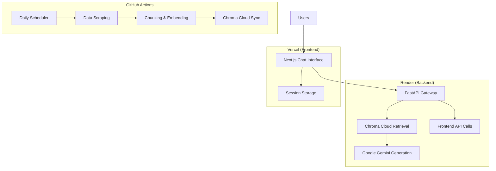

# Deployment Plan: Mutual Fund FAQ Assistant

## Overview
This document outlines the complete deployment strategy for the Mutual Fund FAQ Assistant across three key platforms:
- **Scheduler**: GitHub Actions (Data Ingestion & Embedding)
- **Backend**: Render (FastAPI Application)
- **Frontend**: Vercel (Next.js Application)

---

## 1. Architecture Overview



---

## 2. Backend Deployment (Render)

### 2.1 Render Configuration

**Service Type**: Web Service
**Runtime**: Python 3.10
**Build Command**: `pip install -r requirements.txt`
**Start Command**: `uvicorn main:app --host 0.0.0.0 --port $PORT`

### 2.2 Directory Structure for Render
```
.
apps/api/
  main.py
  requirements.txt
  core/
    retriever.py
    generator.py
  routers/
    chat.py
  utils/
    pii_scrubber.py
```

### 2.3 Render Environment Variables
```bash
# Required Environment Variables
CHROMA_API_KEY=your_chroma_cloud_api_key
CHROMA_TENANT=your_chroma_tenant
CHROMA_DATABASE=your_chroma_database
GOOGLE_API_KEY=your_google_gemini_api_key
PYTHON_VERSION=3.10

# Optional
LOG_LEVEL=INFO
MAX_RESPONSE_TIME=3000
```

### 2.4 Render Deployment Steps

1. **Create New Web Service**
   - Connect GitHub repository
   - Select `apps/api` as root directory
   - Configure Python runtime

2. **Environment Setup**
   - Add all environment variables
   - Configure health check endpoint (`/health`)
   - Set auto-deploy on main branch push

3. **Health Check Implementation**
   ```python
   # Add to apps/api/main.py
   @app.get("/health")
   async def health_check():
       return {"status": "healthy", "timestamp": datetime.utcnow()}
   ```

---

## 3. Frontend Deployment (Vercel)

### 3.1 Vercel Configuration

**Framework**: Next.js
**Build Command**: `npm run build`
**Output Directory**: `.next`
**Install Command**: `npm install`

### 3.2 Vercel Project Structure
```
.
apps/web/
  package.json
  next.config.js
  app/
    layout.js
    page.js
    components/
      ChatInterface.js
      DisclaimerBanner.js
  lib/
    api.js
```

### 3.3 Vercel Environment Variables
```bash
# Production API URL
NEXT_PUBLIC_API_URL=https://your-app-name.onrender.com

# Optional
NEXT_PUBLIC_APP_NAME=Mutual Fund FAQ Assistant
NEXT_PUBLIC_VERSION=1.0.0
```

### 3.4 Vercel Deployment Steps

1. **Import Project**
   - Connect Vercel to GitHub repository
   - Select `apps/web` as root directory
   - Auto-detect Next.js framework

2. **Configure Build Settings**
   - Set build command and output directory
   - Add environment variables
   - Configure custom domain (optional)

3. **API Configuration**
   ```javascript
   // apps/web/lib/api.js
   const API_BASE_URL = process.env.NEXT_PUBLIC_API_URL || 'http://localhost:8000';
   
   export async function chatQuery(threadId, query, schemeName) {
     const response = await fetch(`${API_BASE_URL}/api/chat/query`, {
       method: 'POST',
       headers: { 'Content-Type': 'application/json' },
       body: JSON.stringify({ thread_id: threadId, query, scheme_name })
     });
     return response.json();
   }
   ```

---

## 4. Scheduler Deployment (GitHub Actions)

### 4.1 Enhanced GitHub Actions Workflow

Update `.github/workflows/ingest.yml`:

```yaml
name: Daily Mutual Fund Fact Ingestion

on:
  schedule:
    - cron: '45 3 * * *' # 9:15 AM IST daily
  workflow_dispatch:

jobs:
  ingest:
    runs-on: ubuntu-latest
    
    steps:
      - name: Checkout repository
        uses: actions/checkout@v4

      - name: Set up Python
        uses: actions/setup-python@v5
        with:
          python-version: '3.10'

      - name: Install dependencies
        run: |
          python -m pip install --upgrade pip
          pip install playwright requests
          playwright install chromium

      - name: Run Ingestion Script
        env:
          PYTHONPATH: ${{ github.workspace }}
        run: python scripts/ingest.py

      - name: Upload Data Artifacts
        uses: actions/upload-artifact@v4
        with:
          name: mutual-fund-data
          path: |
            data/raw/
            data/processed/manifest.json
          retention-days: 7

  embed:
    name: Chunking & Embedding
    needs: ingest
    runs-on: ubuntu-latest

    steps:
      - name: Checkout repository
        uses: actions/checkout@v4

      - name: Download ingested data artifact
        uses: actions/download-artifact@v4
        with:
          name: mutual-fund-data

      - name: Set up Python
        uses: actions/setup-python@v5
        with:
          python-version: '3.10'

      - name: Install embedding dependencies
        run: |
          python -m pip install --upgrade pip
          pip install chromadb sentence-transformers requests python-dotenv

      - name: Run Chunking & Embedding (Cloud Sync)
        env:
          CHROMA_API_KEY: ${{ secrets.CHROMA_API_KEY }}
          CHROMA_TENANT: ${{ secrets.CHROMA_TENANT }}
          CHROMA_DATABASE: ${{ secrets.CHROMA_DATABASE }}
        run: python scripts/index.py

  notify:
    name: Notify Deployment Status
    needs: [ingest, embed]
    runs-on: ubuntu-latest
    if: always()
    
    steps:
      - name: Notify Success
        if: needs.ingest.result == 'success' && needs.embed.result == 'success'
        run: |
          echo "Daily data ingestion completed successfully"
          # Add Slack/Discord notification here if needed
      
      - name: Notify Failure
        if: needs.ingest.result == 'failure' || needs.embed.result == 'failure'
        run: |
          echo "Data ingestion failed - check logs"
          # Add failure notification here
```

---

## 5. Environment Variables & Secrets Management

### 5.1 GitHub Repository Secrets
```bash
# GitHub Secrets (Settings > Secrets and variables > Actions)
CHROMA_API_KEY=your_chroma_cloud_api_key
CHROMA_TENANT=your_chroma_tenant
CHROMA_DATABASE=your_chroma_database
GOOGLE_API_KEY=your_google_gemini_api_key
```

### 5.2 Render Environment Variables
Add these in Render Dashboard > Environment:
```bash
CHROMA_API_KEY=${CHROMA_API_KEY}
CHROMA_TENANT=${CHROMA_TENANT}
CHROMA_DATABASE=${CHROMA_DATABASE}
GOOGLE_API_KEY=${GOOGLE_API_KEY}
PYTHON_VERSION=3.10
```

### 5.3 Vercel Environment Variables
Add these in Vercel Dashboard > Settings > Environment Variables:
```bash
NEXT_PUBLIC_API_URL=https://your-app-name.onrender.com
NEXT_PUBLIC_APP_NAME=Mutual Fund FAQ Assistant
```

---

## 6. Deployment Sequence

### 6.1 Initial Setup (One-time)

1. **Prepare Repositories**
   - Ensure all code is pushed to GitHub
   - Verify environment variable placeholders
   - Test local functionality

2. **Set up External Services**
   - Create Chroma Cloud account and database
   - Get Google Gemini API key
   - Create accounts on Render and Vercel

3. **Configure Secrets**
   - Add all required secrets to GitHub
   - Set up environment variables on Render and Vercel

### 6.2 Deployment Order

1. **Deploy Backend First (Render)**
   - Create Render web service
   - Configure environment variables
   - Deploy and test API endpoints
   - Verify health check endpoint

2. **Deploy Scheduler (GitHub Actions)**
   - Update workflow with correct paths
   - Test manual workflow run
   - Verify daily scheduling
   - Check Chroma Cloud connectivity

3. **Deploy Frontend (Vercel)**
   - Import project to Vercel
   - Configure API URL environment variable
   - Deploy and test UI functionality
   - Verify API connectivity

---

## 7. Monitoring & Maintenance

### 7.1 Health Checks

**Backend Health Check** (Render):
```bash
curl https://your-app-name.onrender.com/health
```

**Frontend Health Check** (Vercel):
- Monitor Vercel Analytics
- Check build logs for errors
- Test API connectivity regularly

### 7.2 Log Monitoring

**GitHub Actions Logs**:
- Monitor daily ingestion success/failure
- Check Chroma Cloud sync status
- Verify data freshness

**Render Logs**:
- Monitor API response times
- Check error rates
- Track memory usage

**Vercel Logs**:
- Monitor build failures
- Check API call success rates
- Track user interaction patterns

### 7.3 Backup Strategy

**Data Backup**:
- Chroma Cloud provides automatic backups
- GitHub Actions artifacts retained for 7 days
- Git repository maintains code history

**Configuration Backup**:
- Export Render environment variables
- Document all API keys and secrets
- Maintain infrastructure as code

---

## 8. Security Considerations

### 8.1 API Key Management
- Never commit API keys to repository
- Use platform-specific secret management
- Rotate keys regularly
- Monitor API usage and costs

### 8.2 Network Security
- Enable HTTPS on all endpoints
- Use CORS properly on backend
- Implement rate limiting
- Monitor for suspicious activity

### 8.3 Compliance
- Maintain SEBI compliance in responses
- Log all user interactions for audit
- Implement advisory refusal mechanisms
- Regular compliance reviews

---

## 9. Cost Optimization

### 9.1 Platform Costs
- **Render**: Free tier available, ~$7/month for production
- **Vercel**: Free tier for hobby projects
- **GitHub Actions**: 2000 minutes/month free
- **Chroma Cloud**: Variable based on usage

### 9.2 API Costs
- **Google Gemini**: Pay-per-use, monitor token usage
- **Data Transfer**: Optimize API call sizes
- **Storage**: Regular cleanup of old artifacts

---

## 10. Rollback Strategy

### 10.1 Backend Rollback
- Render supports automatic rollbacks
- Maintain previous stable version
- Test rollback procedures regularly

### 10.2 Frontend Rollback
- Vercel maintains deployment history
- One-click rollback to previous version
- Preview deployments for testing

### 10.3 Data Rollback
- Chroma Cloud maintains version history
- GitHub Actions can be re-run with specific commits
- Manual data restoration procedures documented

---

## 11. Post-Deployment Checklist

### 11.1 Functional Testing
- [ ] Backend API endpoints responding correctly
- [ ] Frontend UI loads and functions
- [ ] Chat interface works end-to-end
- [ ] Advisory refusal mechanisms active
- [ ] Citations and sources displayed correctly

### 11.2 Integration Testing
- [ ] GitHub Actions scheduler running daily
- [ ] Data ingestion pipeline working
- [ ] Chroma Cloud synchronization successful
- [ ] Frontend-backend communication working

### 11.3 Performance Testing
- [ ] API response times < 3 seconds
- [ ] Frontend load times acceptable
- [ ] Memory usage within limits
- [ ] Error rates < 1%

### 11.4 Compliance Testing
- [ ] No investment advice being provided
- [ ] All responses include citations
- [ ] Disclaimer banners displayed
- [ ] SEBI compliance maintained

---

## 12. Troubleshooting Guide

### 12.1 Common Issues

**Backend Not Starting**:
- Check environment variables in Render
- Verify Python dependencies
- Review build logs

**Frontend API Errors**:
- Verify NEXT_PUBLIC_API_URL configuration
- Check CORS settings on backend
- Test API endpoints directly

**Scheduler Failures**:
- Review GitHub Actions logs
- Check Chroma Cloud connectivity
- Verify secret configuration

### 12.2 Emergency Procedures

**Service Outage**:
1. Check platform status pages
2. Review recent deployments
3. Initiate rollback if needed
4. Notify stakeholders

**Data Issues**:
1. Pause GitHub Actions scheduler
2. Manual data verification
3. Re-run ingestion with fixes
4. Resume automated scheduling

---

## 13. Next Steps

After successful deployment:

1. **Monitoring Setup**: Configure alerts and dashboards
2. **User Testing**: Conduct beta testing with real users
3. **Performance Tuning**: Optimize based on usage patterns
4. **Feature Enhancement**: Plan additional features based on feedback
5. **Scale Planning**: Prepare for increased user load

---

*Last Updated: April 19, 2026*
*Version: 1.0*
